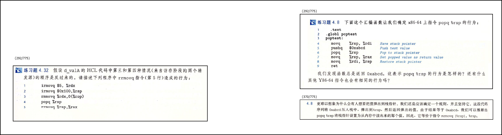
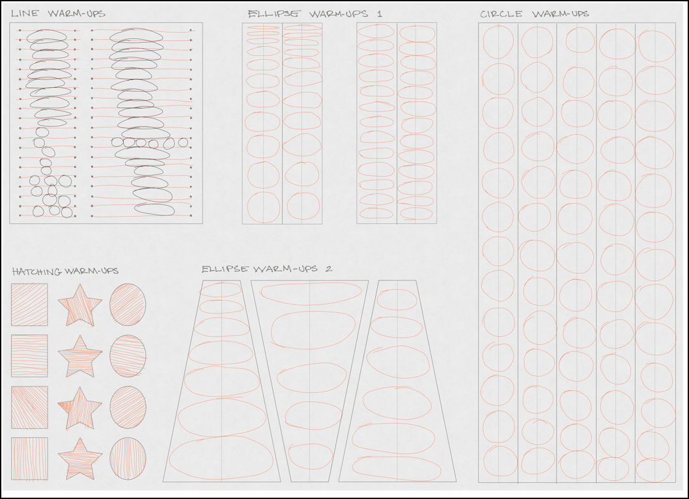
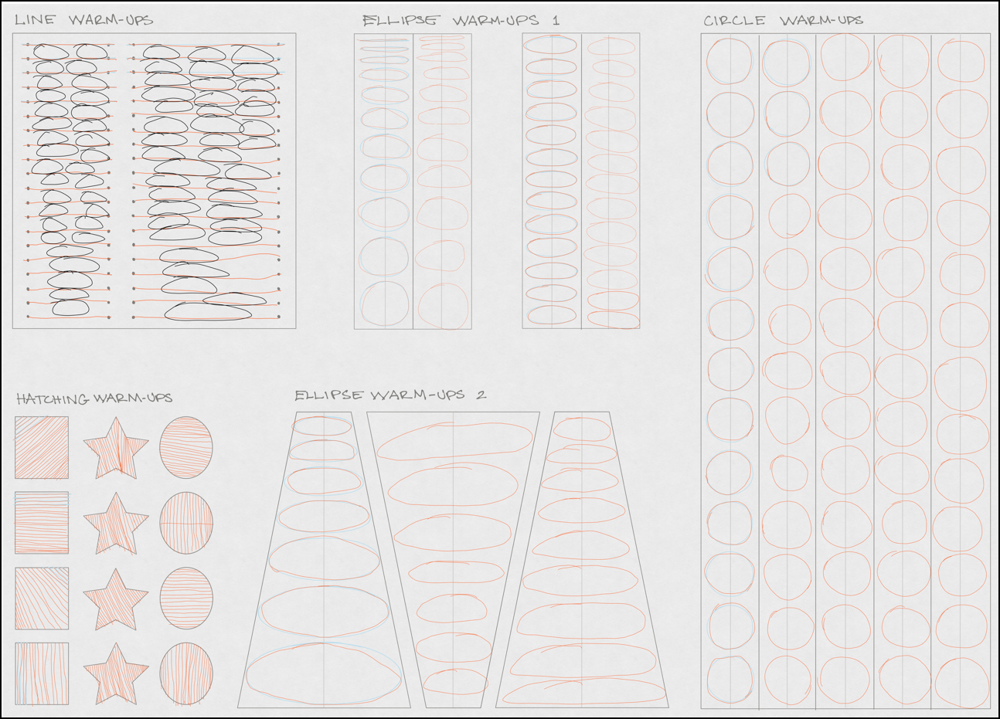

# 2022_06-09

## 《癌症真相：医生也在读（新版）》（自己身边的故事）

### Subject: A New Chapter in the Fight & Still Celebrating Life

Hi everyone,  
Well… This wasn’t an email I ever wanted to write - and I certainly did not plan to write to you all so soon after my last celebration email!  

I just revived the results from my latest PET-CT scan.  
My colon cancer has returned & I have been diagnosed Stage IV, with recurrence in both my lymph nodes as in my lungs.  
On one hand the diagnosis feels like an absurd surprise to me because feel 100% healthy but on the other hand, since they have been watching those enlarged nodes since last August, I’ve had months of mental preparation for this possibility.  

# 2022_06-04

## 《CSAPP》，题目4.32
  
  

# 2022_06-03

## mini-os_08-BlockDeviceDriver_笔记

### AvailableRing、UsedRing

AvailableRing:

UsedRing

# 2022_06-02

## 利用Concept来画画

# 2022_06-01

## 利用Concept来画画

## 07-ExterInterrupt_笔记

### 参考
放狗：（gdb how to print registers）

>...【Use e.g. p $rax to print value from a single register. In gdb, remember that access to a register is via $name instead of the more familiar %name . A register is treated as an untyped 8-byte value and when you ask gdb to print it, it shows a decimal integer or hex address.】...

