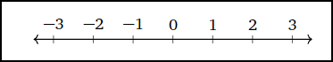
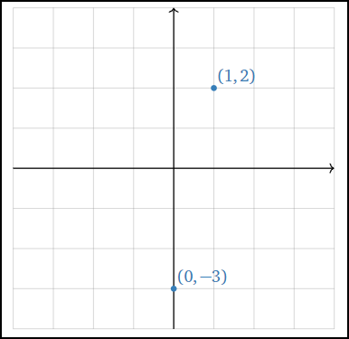
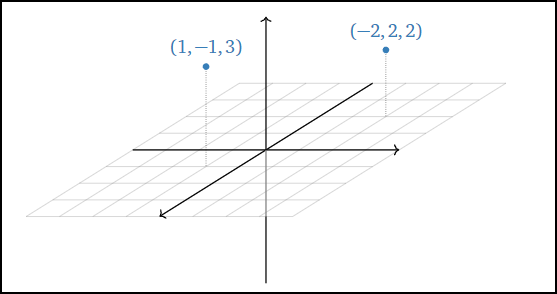
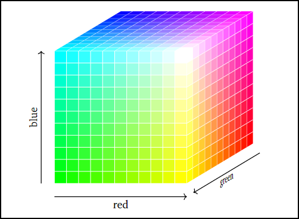
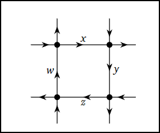

# en_math_2022_06-21

## 《Interactive Linear Algebra》_Chapter1

Systems of Linear Equations: Algebra

* Primary Goal 
  * Solve a system of linear equations algebraically in parametric form.

This chapter is devoted to the algebraic study of systems of linear equations and their solutions.  
We will learn a systematic way of solving equations of the form

$ \begin{cases}  (3)x_1 + (4)x_2 + (10)x_3 +(19)x_4 -(2)x_5 - (3)x_6 = 141 \\\ (7)x_1 + (2)x_2 - (13)x_3 - (7)x_4 + (21)x_5 + (8)x_6 = 2567 \\\ (-1)x_1 + (9)x_2 + (\frac{9}{2})x_3 + (1)x_4 + (14)x_5 + (27)x_6 = 26 \\\ (\frac{1}{2})x_1 + (4)x_2 - (10)x_3 - (11)x_4 + (2)x_5 + (1)x_6 = -15 \end{cases} $  

In Section 1.1, we will introduce systems of linear equations, the class of equations whose study forms the subject of linear algebra.  

In Section 1.2, will present a procedure, called row reduction, for finding all solutions of a system of linear equations.  

In Section 1.3, you will see how to express all solutions of a system of linear equations in a unique way using the parametric form of the general solution.

### 1.1 Systems of Linear Equations

>Objectives
>1. Understand the definition of $R^n$ , and what it means to use $R^n$ to label points on a geometric object.
>2. Pictures: solutions of systems of linear equations, parameterized solution sets.  
>3. Vocabulary words: consistent, inconsistent, solution set.

During the first half of this textbook, we will be primarily concerned with understanding the solutions of systems of linear equations.

>Definition
> An equation in the unknowns $x,y,z,...$ is called linear if both sides of the equation are a sum of (constant) multiples of $x,y,z,...$ plus an optional constant.

For instance,

$ 3x+4y=2z $  
$ -x-z=100 $  

are linear equations, but

$ 3x + yz =3 $  
$ \sin(x) + cos(y) =2 $  

are not.

We will usually move the unknowns to the left side of the equation, and move the constants to the right.  

A system of linear equations is a collection of several linear equations, like  

$$ \begin{cases} x+2y+3z=6 \\\ 2x-3y+2z=14 \\\ 3x+y-z=-2 \end{cases} $$  (1.1.1)

>Definition(Solution sets)
>* A solution of a system of equations is a list of numbers that make all of the equations true simultaneously.
>* The solution set of a system of equations is the collection of all solutions.
>* Solving the system means finding all solutions with formulas involving some number of parameters.

**A system of linear equations need not have a solution.**  
For example, there do not exist numbers $x$ and $y$ making the following two equations true simultaneously:

$ \begin{cases} x+2y=3 \\\ x+2y=-3 \end{cases} $  

In this case, the solution set is empty.  
As this is a rather important property of a system of equations, it has its own name.  

>Definition 
>A system of equations is called inconsistent if it has no solutions. 
>It is called consistent otherwise.

showTable                                                             | no
----------------------------------------------------------------------|--------
$ \begin{cases} x+2y+3z=6 \\\ 2x-3y+2z=14 \\\ 3x+y-z=-2 \end{cases} $ | (1.1.1)

A solution of a system of equations in $n$ variables is a list of $n$ numbers.  
For example, $(x,y,z) = (1,−2,3)$ is a solution of (1.1.1) .  
As we will be studying solutions of systems of equations throughout this text, now is a good time to fix our notions regarding lists of numbers.

#### Line, Plane, Space, Etc.

We use $R$ to denote the set of all real numbers, i.e., the number line.  
This contains numbers like $0,\frac{3}{2},-\pi, 104, ...$  

>Definition 
Let $n$ be a positive whole number.  
We define 
$R^n$ = all ordered n-tuples of real numbers $(x_1,x_2,x_3,...,x_n)$.  
An n-tuple of real numbers is called a point of $R^n$ .  

In other words, $R^n$ is just the set of all (ordered) lists of $n$ real numbers.  
We will draw pictures of $R^n$ in a moment, but keep in mind that this is the definition.  
For example, $(0,\frac{3}{2},-\pi)$ 
and $(1,−2,3)$ 
are points of $R^3$ .

>Example(The number line).  
When $n=1$, we just get $R^1=R$ back:  
Geometrically, this is the number line.  

  

>Example(The Euclidean plane)  
When $n=2$, we can think of $R^2$ as the $xy-plane$.  
We can do so because every point on the plane can be represented by an ordered pair of real numbers, namely, its $x$ and $y-coordinates$.  

  

>Example(3-Space)  
When $n=3$, we can think of $R^3$ as the space we (appear to) live in.  
We can do so because every point in space can be represented by an ordered triple of real numebrs, namely, its $x-,y-,z-coordinates$.  

  

>Interactive: Points in 3-Space.  
(略)

So what is $R^3$ ? or $R^4$ ? or $R^n$?  
These are harder to visualize, so you have to go back to the definition:   
$R^n$ is the set of all ordered n-tuples of real numbers $(x_1,x_2,x_3,...,x_n)$.  

They are still “geometric” spaces, in the sense that our intuition for $R^2$ and $R^3$ often extends to $R^n$.  

We will make definitions and state theorems that apply to any $R^n$ ,  but we will only draw pictures for $R^2$ and $R^3$ .

>Example(Color Space)  
All colors you can see can be described by three quantities:  
the amount of red, green, and blue light in that color. (Humans are [trichromatic](https://en.wikipedia.org/wiki/Trichromacy).)  
Therefore, we can use the points of $R^3$ to label all colors:  
for instance, the point(.2, .4, .9) labels the color with 20% red, 40% green, and 90% blue intensity.  

  

>Example(Traffic Flow)  
In the [Overview](/0x00_Overview.md), we could have used $R^4$ 
to label the amount of traffic $(x,y,z,w)$ passing through four streets.  
In other words, if there are $10,5,3,11$ cars per hour passing through roads $x,y,z,w$ respectively, then this can be recorded by the point $(10,5,3,11)$ in $R^4$ .  
This is useful from a psychological standpoint:  
instead of having four numbers, we are now dealing with just one piece of data.  

  

>Example(QR Codes)
A [QR code](https://en.wikipedia.org/wiki/QR_code) is a method of storing data in a grid of black and white squares in a way that computers can easily read.  
A typical QR code is a $29×29$ grid.  
Reading each line left-to-right and reading the lines top-to-bottom (like you read a book) we can think of such a QR code as a sequence of $29×29=841$ digits, each digit being 1 (for white) or 0 (for black).  
In such a way, the entire QR code can be regarded as a point in $R^{841}$ .  
As in the previous example【Example(Traffic Flow)】, it is very useful from a psychological perspective to view a QR code as a single piece of data in this way.  

  
The QR code for this textbook is a $29×29$ array of black/white squares.

In the above examples, it was useful from a psychological perspective to replace a list of four numbers (representing traffic flow) or of 841 numbers (representing a QR code) by a single piece of data: a point in some $R^{n}$ .  
This is a powerful concept;  
starting in Section 2.2【待写超链接】, we will almost exclusively record solutions of systems of linear equations in this way.  

# en_math_2022_06-06

## 《Interactive Linear Algebra》_Overview

The Subject of This Textbook.  
Before starting with the content of the text, we first ask the basic question:【what is linear algebra?】  
* Linear: having to do with lines, planes, etc.
* Solving equations involving unknowns.

The name of the textbook highlights an import theme:  
The synthesis between algebra and geometry.  
It will be very important to us to understand systems of linear equations both algebraically (writing equations for their solutions) and geometrically (drawing pictures and visualizing).  

### Remark.
At the simple level, solving a system of linear equations is not very hard.  
You probably learned in high school how to solve a system like:  

$ f(x) = \begin{cases} x+3y-z=4 \\\ 2x-y+3z=17 \\\ y-4z=-3 \end{cases} $  

However, in real life one usually has to be more clever.  
* Engineers need to solve many, many equations in many, many variables.  
Here is a tiny example:  

$ f(x) = \begin{cases}  3x_1 + 4x_2 + 10x_3 + 19x_4 - 2x_5 - 3x_6 = 141 \\\ 7x_1 + 2x_2 - 13x_3 - 7x_4 + 21x_5 + 8x_6 = 2567 \\\ -x_1 +9x2 + \frac{3}{2}x_3 + x_4 + 14x_5 + 27x_6 =26 \\\ \frac{1}{2}x_1 + 4x_2 + 10x_3 + 11x_4 + 2x_5 + x_6 = -15 \end{cases} $  

* Often it is enough to know some information about the set of solutions, without having to solve the equations in the first place.  
For instance, does there exist a solution?

* What does the solution set look like geometrically?  
Is there still a solution if we change the 26 to a 27?  

* Sometimes the coefficients also contain parameters, like the eigenvalue equation  
$ f(x) = \begin{cases} (7-\lambda)x \hspace{2mm}+ \hspace{9mm}y \hspace{2mm}+ \hspace{12mm}3z = 0 \\\  \hspace{6mm}-3x \hspace{2mm}+ (2-\lambda)y \hspace{2mm}- \hspace{11mm}3z = 0 \\\  \hspace{6mm}-3x \hspace{2mm}+ \hspace{9mm}2y \hspace{2mm}+ (-1-\lambda)z = 0 \end{cases} $  

----------
上面的内容是手抄的，下面的内容是复制黏贴的。

* In data modeling, a system of equations generally does not actually have a solution.  
In that case, what is the best approximate solution?

1. Solve the matrix equation 【$ Ax=b $】【 (chapters 2–4)】
    * Solve systems of linear equations using matrices, row reduction, and inverses.
    * Analyze systems of linear equations geometrically using the geometry of solution sets and linear transformations.

2. Solve the matrix equation 【$ Ax=\lambda x $】【 (chapters 5–6)】
    * Solve eigenvalue problems using the characteristic polynomial.
    * Understand the geometry of matrices using similarity, eigenvalues, diagonalization, and complex numbers.

3. Approximately solve the the matrix equation【$ Ax=b $】【 (chapter 7)】
    * Find best-fit solutions to systems of linear equations that have no actual solution using least-squares approximations.
    * Study the geometry of closest vectors and orthogonal projections.
This text is roughly half computational.
This text is roughly half computational and half conceptual in nature.  
The main goal is to present a library of linear algebra tools, and more importantly, to teach a conceptual framework for understanding which tools should be applied in a given context. 

> If Matlab can find the answer faster than you can, then your question is just an algorithm: this is not real problem solving.

The subtle part of the subject lies in understanding what computation to ask the computer to do for you—it is far less important to know how to perform computations that a computer can do better than you anyway.

### Uses of Linear Algebra in Engineering
The vast majority of undergraduates at Georgia Tech have to take a course in linear algebra. There is a reason for this:

> Most engineering problems, no matter how complicated, can be reduced to linear algebra:
> * $ Ax = b $
> * $ Ax = \lambda x $
> * $ Ax \approx b $

Here we present some sample problems in science and engineering that require linear algebra to solve.
（…例子省略）	

### How to Use This Textbook 
There are a number of different categories of ideas that are contained in most sections. They are listed at the top of the section, under Objectives, for easy review. We classify them as follows.

* **Recipes**: 
these are algorithms that are generally straightforward (if sometimes tedious), and are usually done by computer in real life.  
They are nonetheless important to learn and to practice.

* **Vocabulary words**:  
forming a conceptual understanding of the subject of linear algebra means being able to communicate much more precisely than in ordinary speech. The vocabulary words have precise definitions, which must be learned and used correctly.

* **Essential vocabulary words**:  
these vocabulary words are essential in that they form the essence of the subject of linear algebra.  
For instance, if you do not know the definition of an eigenvector, then by definition you cannot claim to understand linear algebra.

* **Theorems**:  
these describe in a precise way how the objects of interest relate to each other.  
Knowing which recipe to use in a given situation generally means recognizing which vocabulary words to use to describe the situation, and understanding which theorems apply to that problem.

* **Pictures**:  
visualizing the geometry underlying the algebra means interpreting and drawing pictures of the objects involved.  
The pictures are meant to be a core part of the material in the text: they are not just a pretty add-on.

This textbook is exclusively targeted at Math 1553 at Georgia Tech.  
As such, it contains exactly the material that is taught in that class;  
no more, and no less: students in Math 1553 are responsible for understanding all visible content.  
In the online version some extra material (most examples and proofs, for instance) is hidden, in that one needs to click on a link to reveal it, like this:

### Hidden Content
Hidden content is meant to enrich your understanding of the topic, but is not an official part of Math 1553.  
That said, the text will be very hard to follow without understanding the examples, and studying the proofs is an excellent way to learn the conceptual part of the material. (Not applicable to the PDF version.)

Finally, we remark that there are over 140 interactive demos contained in the text, which were created to illustrate the geometry of the topic.  
Click the “view in a new window” link, and play around with them! You will need a modern browser. Internet Explorer is not a modern browser; try Safari, Chrome, or Firefox.  
Here is a demo from [Section 6.5]( https://textbooks.math.gatech.edu/ila/least-squares.html)  
（…例子省略）

### How to Use This Textbook 
There are a number of different categories of ideas that are contained in most sections. They are listed at the top of the section, under Objectives, for easy review. We classify them as follows.

* **Recipes**: 
these are algorithms that are generally straightforward (if sometimes tedious), and are usually done by computer in real life.  
They are nonetheless important to learn and to practice.

* **Vocabulary words**:  
forming a conceptual understanding of the subject of linear algebra means being able to communicate much more precisely than in ordinary speech. The vocabulary words have precise definitions, which must be learned and used correctly.

* **Essential vocabulary words**:  
these vocabulary words are essential in that they form the essence of the subject of linear algebra.  
For instance, if you do not know the definition of an eigenvector, then by definition you cannot claim to understand linear algebra.

* **Theorems**:  
these describe in a precise way how the objects of interest relate to each other.  
Knowing which recipe to use in a given situation generally means recognizing which vocabulary words to use to describe the situation, and understanding which theorems apply to that problem.

* **Pictures**:  
visualizing the geometry underlying the algebra means interpreting and drawing pictures of the objects involved.  
The pictures are meant to be a core part of the material in the text: they are not just a pretty add-on.

This textbook is exclusively targeted at Math 1553 at Georgia Tech.  
As such, it contains exactly the material that is taught in that class;  
no more, and no less: students in Math 1553 are responsible for understanding all visible content.  
In the online version some extra material (most examples and proofs, for instance) is hidden, in that one needs to click on a link to reveal it, like this:

### Hidden Content
Hidden content is meant to enrich your understanding of the topic, but is not an official part of Math 1553.  
That said, the text will be very hard to follow without understanding the examples, and studying the proofs is an excellent way to learn the conceptual part of the material. (Not applicable to the PDF version.)

Finally, we remark that there are over 140 interactive demos contained in the text, which were created to illustrate the geometry of the topic.  
Click the “view in a new window” link, and play around with them! You will need a modern browser. Internet Explorer is not a modern browser; try Safari, Chrome, or Firefox.  
Here is a demo from [Section 6.5]( https://textbooks.math.gatech.edu/ila/least-squares.html)  
（…例子省略）