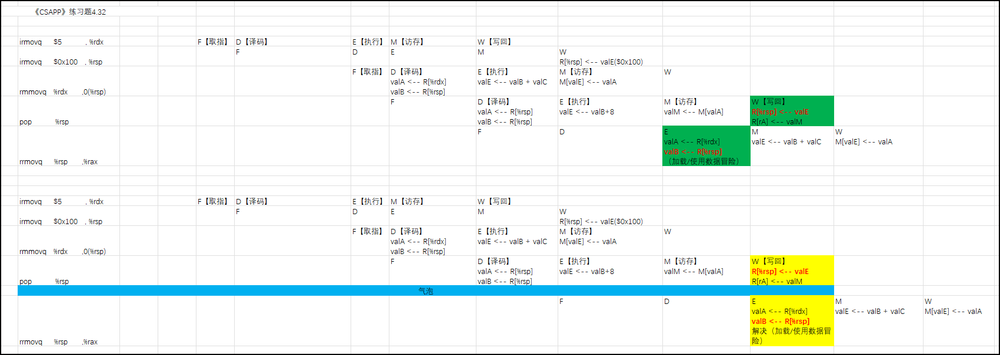
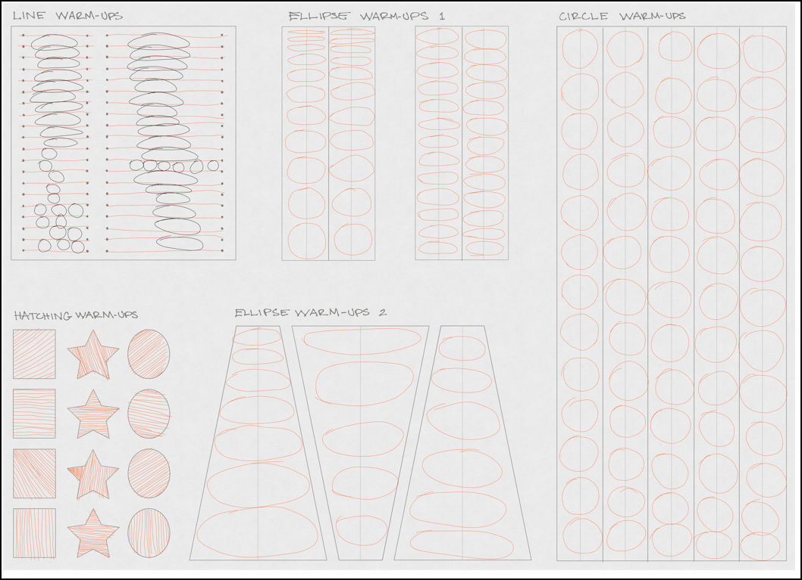
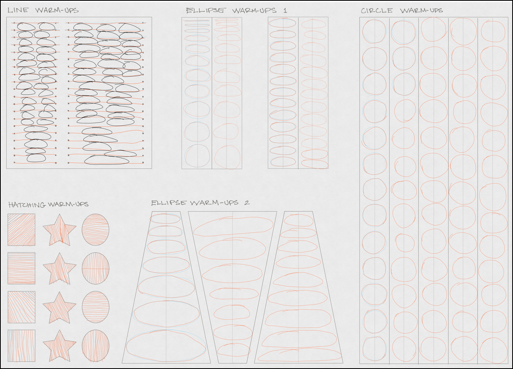

# 2022_06-05

# 2022_06-04

## 《CSAPP》，题目4.32
  
  

# 2022_06-03

## mini-os_08-BlockDeviceDriver_笔记

### AvailableRing、UsedRing

AvailableRing:

UsedRing

# 2022_06-02

## 利用Concept来画画

# 2022_06-01

## 利用Concept来画画

## 07-ExterInterrupt_笔记

### 参考
放狗：（gdb how to print registers）

>...【Use e.g. p $rax to print value from a single register. In gdb, remember that access to a register is via $name instead of the more familiar %name . A register is treated as an untyped 8-byte value and when you ask gdb to print it, it shows a decimal integer or hex address.】...

